# Duranta Open5GS GUI 📡

<p align="center">
  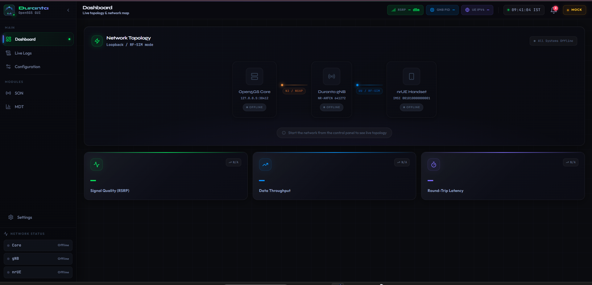
</p>

Welcome to the **Duranta Open5GS GUI** — a world-class, next-generation control panel designed as the visual frontend for the **Duranta OpenAirInterface5G (OAI)** codebase and the **Open5GS** 5G core network.

Instead of dealing with complex Linux terminal commands and manually editing `.conf` files, this UI provides a sleek, dark-mode interface to manage, monitor, and configure a complete simulated 5G network (Core, Base Station, and User Equipment) right from your browser.

---

## 🌟 What Is This Project Actually Doing?

To run a private 5G network locally without expensive hardware, we use software simulators. A 5G network consists of three main pieces:

1. **The Core Network (AMF, UPF, etc.)** — We use **Open5GS** for this. It acts as the brain, handling internet routing and subscriber authentication.
2. **The Base Station / Tower (gNB)** — We use the `nr-softmodem` binary from the Duranta OAI codebase to simulate the cell tower broadcasting radio waves.
3. **The Mobile Phone (UE)** — We use the `nr-uesoftmodem` binary to simulate a 5G smartphone connecting to our tower.

This frontend acts as the **"Conductor"** for all three pieces — configure how they talk to each other, start/stop services, and visually monitor complex 3GPP protocol messages (RRC, NGAP, NAS) flowing between them in real-time.

---

## 🧙 Setup Wizard — Step-by-Step Guide

When you first launch the application (or navigate to `/welcome`), you are greeted by the **3-step Setup Wizard**. This wizard automates the entire process of getting the network stack ready.

> **Note:** By default, the wizard runs in **MOCK MODE** — it simulates all steps without a running backend. See [Disabling Mock Mode](#disabling-mock-mode-connecting-to-your-backend) to connect to a real server.

---

### Step 1: Welcome Screen

<p align="center">
  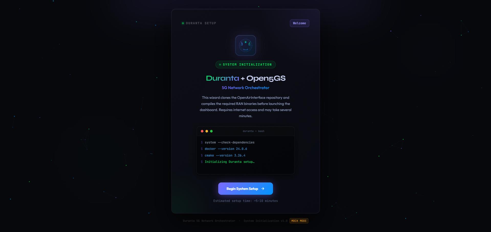
</p>

**What you see:**
- The **Duranta + Open5GS** branded title with a custom 5G signal tower logo
- An animated particle network background showing the connectivity theme
- A live terminal preview showing the dependency check commands that will run on your Linux machine
- The **"Begin System Setup"** button to start the automation

**What it does:**
This screen is purely informational. It confirms the wizard is initializing and gives you a preview of the commands it is about to run. Clicking **Begin System Setup** transitions to Step 2.

---

### Step 2: Clone Repository

<p align="center">
  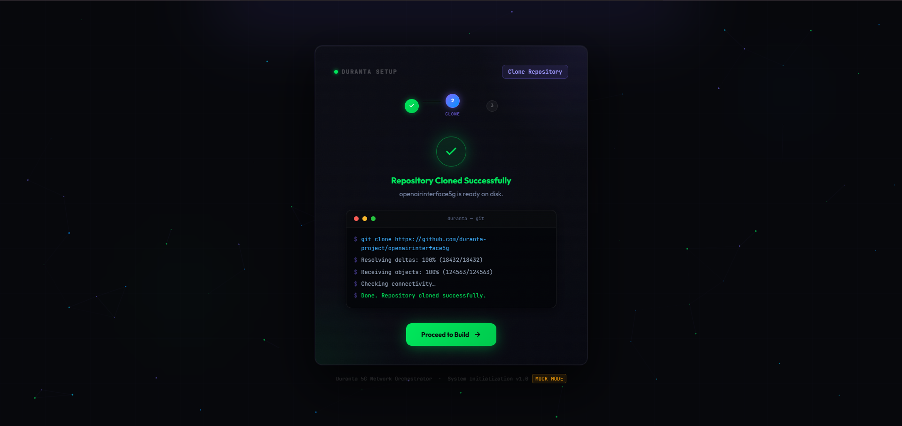
</p>

**What you see:**
- A step indicator at the top showing progress (Step 2 of 3 highlighted)
- A spinner while the clone operation runs
- A terminal window showing the live `git clone` output
- A success (✓) or error (✕) icon once the operation completes
- **"Proceed to Build"** button on success, or **"Retry Clone"** on failure

**What it does:**
This step calls the backend endpoint `POST /api/setup`. The backend executes:
```bash
git clone https://github.com/duranta-project/openairinterface5g
```
It clones the Duranta fork of the OpenAirInterface5G repository to your Linux machine's disk. This is required before the build step can run.

**Expected duration:** 1–3 minutes depending on your internet speed.

---

### Step 3: Compile Binaries (Build)

<p align="center">
  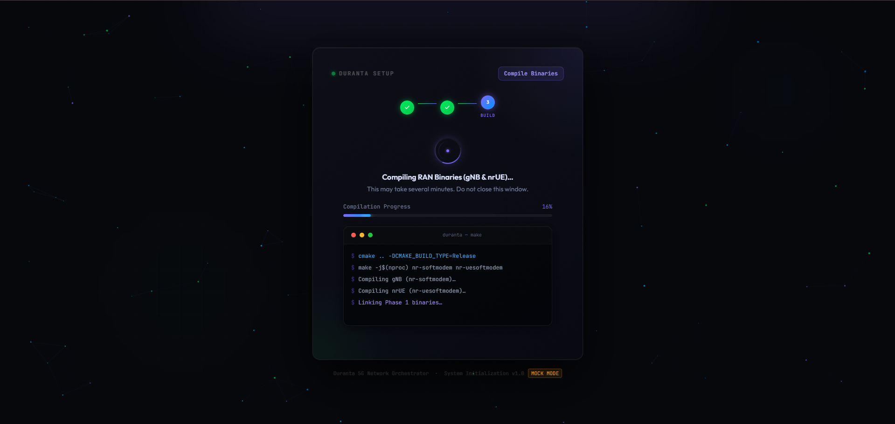
</p>

**What you see:**
- A spinning violet loader while compilation is in progress
- A live **compilation progress bar** that fills from 0% to 100%
- A terminal window showing `cmake` and `make` output
- A success state once both binaries are compiled

<p align="center">
  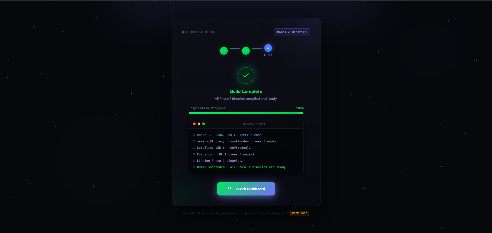
</p>

**What it does:**
This step calls the backend endpoint `POST /api/build`. The backend executes:
```bash
cmake .. -DCMAKE_BUILD_TYPE=Release
make -j$(nproc) nr-softmodem nr-uesoftmodem
```
This compiles the two critical binaries:
- **`nr-softmodem`** — The gNB (base station / cell tower) process
- **`nr-uesoftmodem`** — The nrUE (simulated 5G handset) process

**Expected duration:** 5–15 minutes depending on your CPU core count. **Do not close the browser window** during this step.

Once complete, clicking **"Launch Dashboard"** takes you to the main application.

---

## 🔓 Disabling Mock Mode (Connecting to Your Backend)

By default, the wizard runs in **MOCK MODE** — it simulates the API calls with fake delays so you can view the UI without a backend. When your real backend server is running, you must disable this.

### Step 1: Open the wizard file

Open the file:
```
src/pages/SetupWizard.jsx
```

### Step 2: Change `DEV_MOCK` to `false`

Find these two constants near the top of the file (around lines 6–11):

```javascript
// ─── API Base URL ─────────────────────────────────────────────────────────
// Swap this for your actual backend URL, e.g. "http://localhost:3000"
const API_BASE = ''

// ─── DEV MOCK ─────────────────────────────────────────────────────────────
// Set to true to simulate API success without a running backend.
// Set to false (or remove) when your real backend is live.
const DEV_MOCK = true   // ← CHANGE THIS TO false
```

Change them to:

```javascript
// Point this to your backend server
const API_BASE = 'http://localhost:8000'  // ← your actual backend URL

const DEV_MOCK = false  // ← backend is live
```

### Step 3: What your backend must expose

Your backend (FastAPI, Express, etc.) must expose these two endpoints:

| Method | Endpoint      | Description                                | Success Response              |
|--------|---------------|--------------------------------------------|-------------------------------|
| `GET`  | `/api/setup`  | Clones the OAI repository                  | `{ "success": true }`         |
| `GET`  | `/api/build`  | Runs `cmake` + `make` to compile binaries  | `{ "success": true }`         |

On failure, both endpoints should return:
```json
{ "success": false, "message": "Descriptive error message" }
```

> ⚠️ **Important:** The endpoints must return `Content-Type: application/json`. If they return HTML (like a 404 page), the wizard will display a helpful error: *"Server returned HTTP 404 — expected JSON but got HTML."*

### Step 4: CORS (if backend is on a different port)

If your Vite dev server runs on `http://localhost:5173` and your backend on `http://localhost:8000`, you must enable CORS on your backend. For **FastAPI**:

```python
from fastapi.middleware.cors import CORSMiddleware

app.add_middleware(
    CORSMiddleware,
    allow_origins=["http://localhost:5173"],
    allow_methods=["*"],
    allow_headers=["*"],
)
```

---

## 📸 Detailed Tour of the UI Features

### 1. Dashboard (Network Overview)


**What this UI part does:**
- **Live Topology Map**: This animated graph represents the connection state between your Open5GS AMF (Core), Duranta gNB (Tower), and Duranta UE (Phone). When nodes glow, connections are established.
- **Network Status Panel (Sidebar)**: Quick indicators showing if Core (`127.0.0.5`), gNB (`NR-ARFCN`), and UE (`IMSI:001`) processes are running.
- **KPI Cards**: Display real-time network metrics — signal quality (RSRP), throughput, and latency.

### 2. Live Logs (Under the Hood)
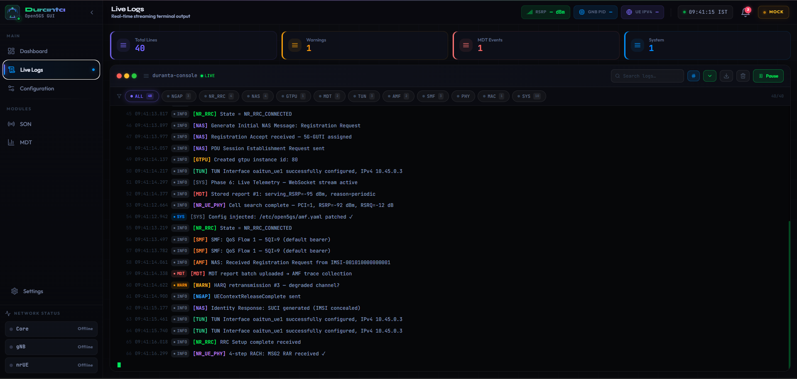

**Smart Log Filtering:**
<p align="center">
  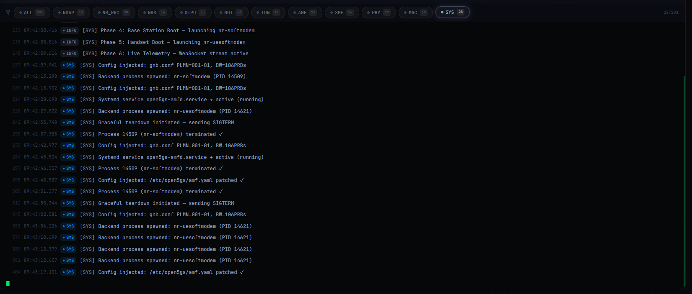
  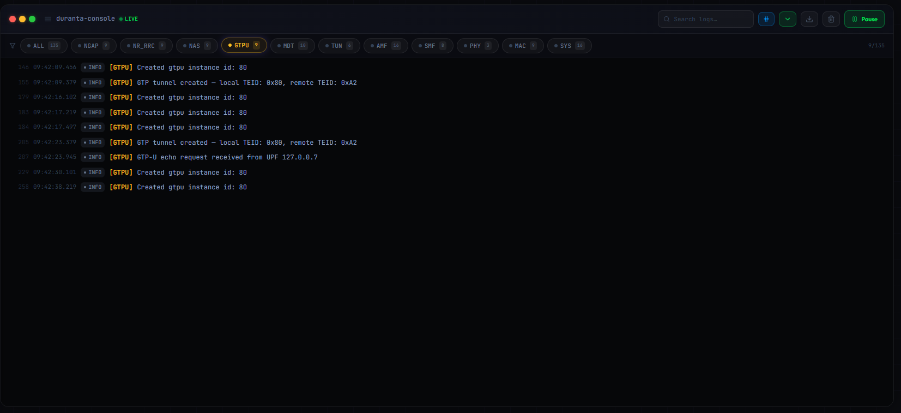
</p>

**What this UI part does:**
- **Real-Time Terminal Feed**: Intercepts raw stdout from `nr-softmodem` and `nr-uesoftmodem` processes.
- **Protocol Filter Pills**: Isolate specific 5G protocol layers:
  - **`[NGAP]`** — Messages between gNB and AMF (e.g., `NGSetupRequest`)
  - **`[RRC]`** — Radio resource control messages (e.g., `RRCSetupComplete`)
  - **`[NAS]`** — Authentication and registration messages
  - **Warnings/Errors** — Instantly isolates `RSRP_DROP` or connection failures

### 3. Configuration (Network Settings)
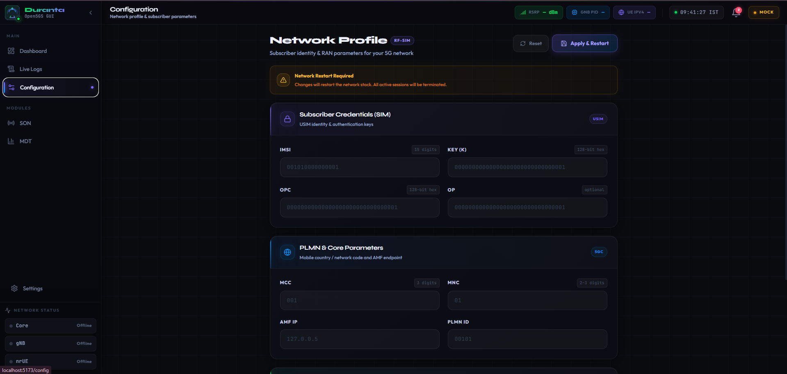

**What this UI part does:**
This page replaces manual `vim` editing of complex `.conf` files.
- **Subscriber Credentials (SIM)**: Edit IMSI, Key (K), and OPc fields to update the `uicc0` block inside your `ue.conf`
- **PLMN & Core Parameters**: Update MCC, MNC, and AMF IP to configure the `plmn_list` and `amf_ip_address` in your gNB config
- **Apply & Restart**: Safely saves files and restarts the underlying Linux processes

### 4. MDT Module (Minimization of Drive Tests)

**What this UI part does:**
Visualizes our custom MDT feature added to OAI RRC C-code:
- The UE constantly measures signal strength (RSRP)
- If signal drops below a threshold, it's saved in a 64-slot ring buffer
- The UE packages samples into an ASN.1 `MeasurementReport` and sends it to the Tower
- This UI intercepts those reports and displays them as a color-coded bar chart

### 5. SON Module (Self-Organizing Network)

A planned module for automatic optimization of:
- Coverage (antenna tilt & power)
- Handover (A3/A5 event thresholds)
- Load balancing (UE redistribution)
- Interference management (ICIC/eICIC)

*Coming in a future sprint.*

---

## 🖼️ Full Application Gallery

<details>
<summary><b>Click to expand and view all screenshots</b></summary>
<br>

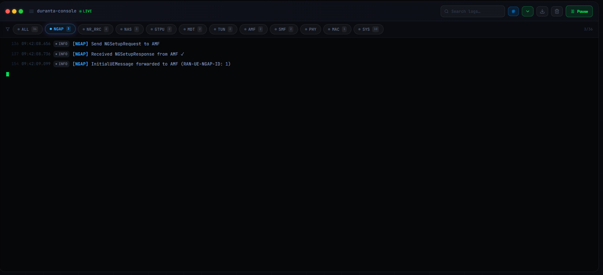
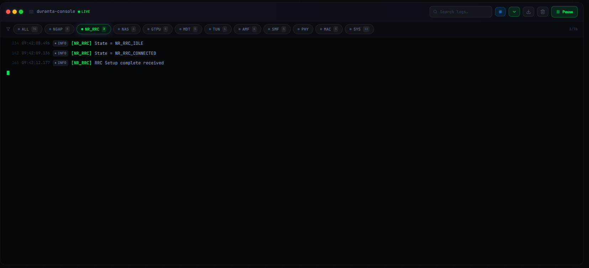
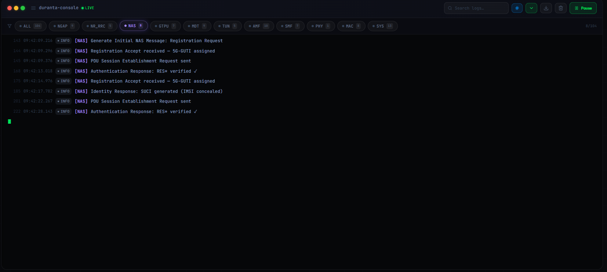
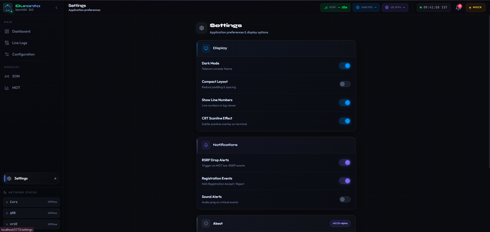
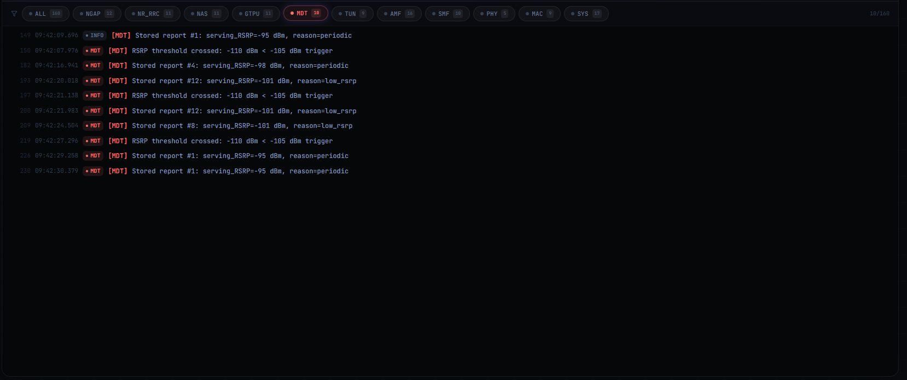
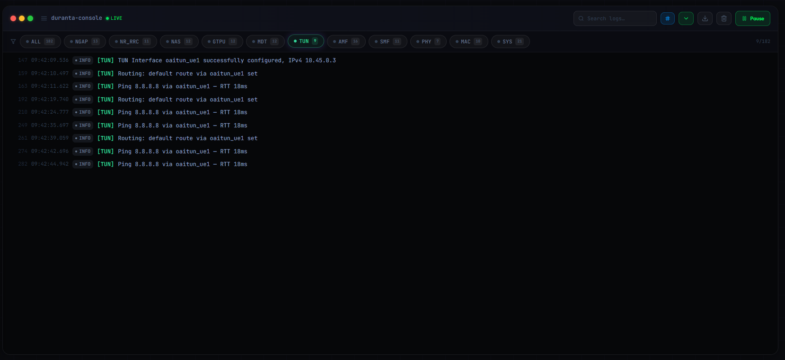
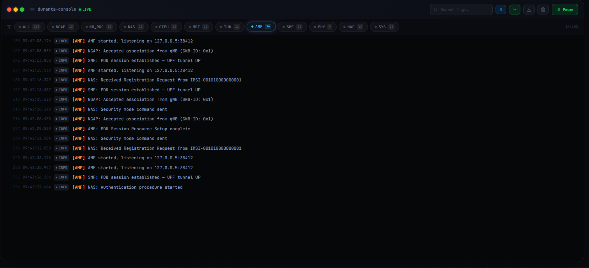
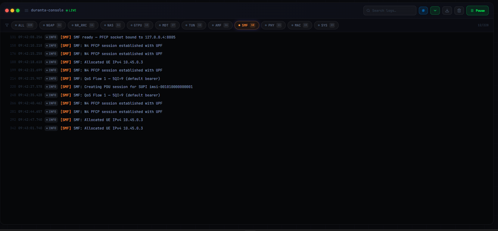
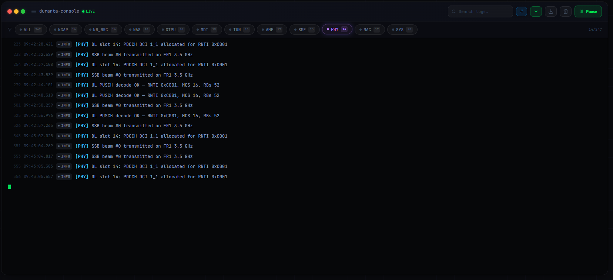
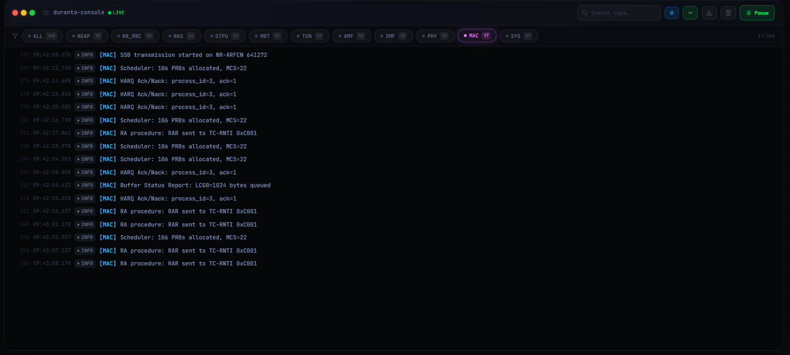
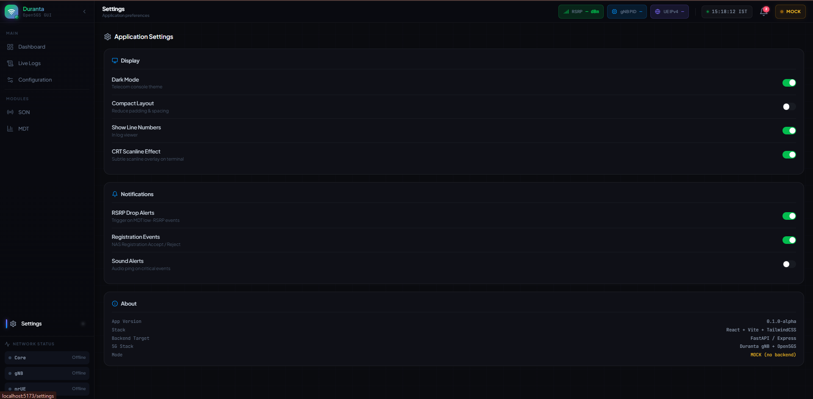
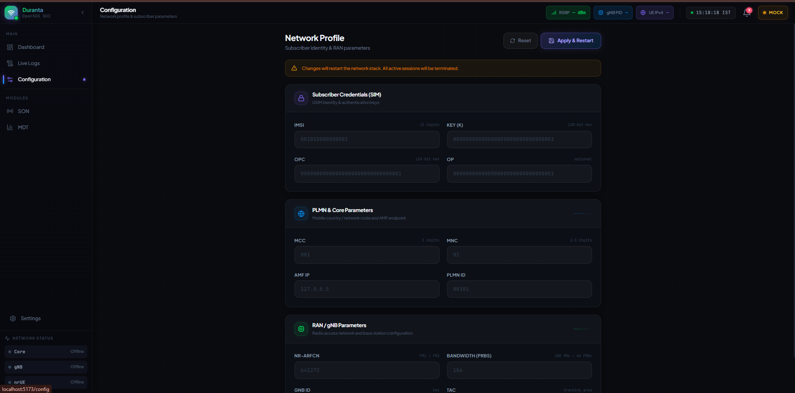

</details>

---

## 💻 Setting up the Project on Another Device

### Step 1: Install Node.js (Required)
1. Go to [https://nodejs.org/](https://nodejs.org/)
2. Download the **LTS** version
3. Verify: `node -v` should print a version number (e.g., `v18.x.x`)

### Step 2: Get the Code
```bash
git clone <YOUR_GITHUB_REPO_URL>
cd Hnnoix
```

### Step 3: Install Dependencies
```bash
npm install
```
*(Downloads everything into `node_modules` — takes 1–2 minutes)*

### Step 4: Run the Application
```bash
npm run dev
```
Open the printed URL in your browser (usually `http://localhost:5173/`).

The app will redirect you to `/welcome` — the Setup Wizard — on first load.

---

## 📷 Screenshot Filenames to Capture

To complete the README documentation, take screenshots of each wizard step and save them to `public/screenshots/`:

| Screenshot File | What to Capture |
|---|---|
| `wizard-step-1-welcome.png` | The welcome screen of the Setup Wizard with the logo visible |
| `wizard-step-2-clone.png` | Step 2 while the clone is in progress (spinner shown) |
| `wizard-step-3-build.png` | Step 3 while build is compiling (progress bar shown) |
| `wizard-step-3-build-success.png` | Step 3 after successful build (green checkmark + Launch button) |

---

## 🛠️ Tech Stack

| Layer | Technology |
|---|---|
| **Frontend Framework** | React 18 with Vite 5 |
| **Styling** | Tailwind CSS v3 with custom glassmorphism design system |
| **Typography** | Plus Jakarta Sans (UI) · JetBrains Mono (terminal) |
| **Icons** | Lucide React |
| **Routing** | React Router v6 |
| **Backend Protocol** | REST JSON API (FastAPI / Express) |
| **5G Stack** | Duranta gNB (OAI fork) + Open5GS Core |
